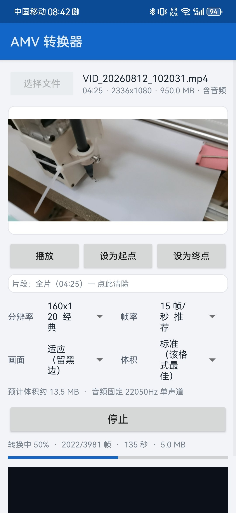

# AMV 转换器

把手机里的**视频 / GIF 动图 / 图片 / 音乐**转换成本地播放器（老式 MP3/MP4/MP5）能播的
**AMV（Actions Media Video）** 格式，并**内置 AMV 播放器**。
全程离线、本地转换、不联网、不上传。


上传到 GitHub 后，取消下面这行注释并把 Li-Zhengyu/amv-converter-android 换成你的仓库：


> **English**: A ~170 KB Android app that converts video, animated GIFs, images and audio into
> the AMV format used by cheap MP3/MP4/MP5 players - and plays them back, since Android has no
> AMV support at all. The AMV encoder, decoder, container reader/writer and scaler are original
> pure-Java code; no FFmpeg is bundled or linked. The format itself was reverse engineered from
> FFmpeg's source and validated byte-for-byte against it - see
> [`docs/AMV-format-spec.md`](docs/AMV-format-spec.md).



*(v1.0 真机截图。v1.1 已重新设计界面 —— 设置项改为 chip 选择器、新增播放器与批量模式，
欢迎补充新截图。)*

---

## 下载安装

从 [Releases](../../releases) 下载 `AMV-Converter-x.y.apk`，传到手机点击安装即可。

- 支持 **Android 5.0 及以上**（minSdk 21 / targetSdk 33）
- 32 位 / 64 位、各种 CPU 都能装（纯 Java，无 `.so`）
- 首次安装需允许"未知来源应用"

## 功能

| | |
|---|---|
| **转换** | 视频 / GIF 动图 / 图片 / 纯音频（自动生成标题封面）→ AMV |
| **批量转换** | 一次多选，统一参数依次转换；逐条状态 + 总进度 + 结果汇总 |
| **片段裁剪** | 设为起点 / 设为终点，只转需要的一段 |
| **实时预览** | 转换中显示**真正编码后的画面**（把 AMV 帧按播放器方式重组成 JPEG 再显示） |
| **内置播放器** | 播放转换结果，也能直接播放手机里已有的 `.amv`；支持播放/暂停/逐帧/拖动定位 |
| **系统打开方式** | 文件管理器或分享里点 `.amv`，可选本 App 打开 |
| **参数** | 7 档分辨率 / 7 档帧率 / 3 种画面适配 / 3 档体积，含**实测可播放的推荐组合** |

**输入格式**：MP4 / MKV / WebM / AVI / MOV / 3GP / TS / FLV 等（取决于设备解码器）、
GIF、JPG / PNG / WebP、MP3 / M4A / AAC / WAV / FLAC / OGG。

**不需要任何权限**（安卓 10+）：选文件用系统文件选择器，保存走 MediaStore。

---

## 为什么不用 FFmpeg

FFmpeg **不能**直接用于本项目（虽然它是本项目的验证基准）：

| | 本项目 | 打包 ffmpeg-kit |
|---|---|---|
| APK 体积 | **170 KB** | 40–80 MB（每 ABI） |
| 解码 | MediaCodec **硬解**，不落地 RGB | 软解，或另写 hwaccel 管线 |
| 授权 | 无 GPL 纠葛 | `full` 构建为 GPL |
| 维护性 | 自主 | ffmpeg-kit 已于 2025 年初归档、Maven 二进制下架 |

更关键的是 **ffmpeg 的 AMV 复用器有硬限制**。一条在真实播放器上验证可用的命令是：

```bash
ffmpeg -i in.mp4 -ac 1 -ar 22050 -r 10 -vf "scale=160:128" \
       -block_size 2205 -c:v amv -c:a adpcm_ima_amv out.amv
```

它能用，是因为三个数字恰好落在安全角落（`10` 整除 `22050`；`block_size` = 22050/10；
高度 `128` 是 16 的倍数）。改一个数字就会失败（均为实测）：

- `-r 12` → `Invalid audio frame size. Got 1838, wanted 1837`
- 高度改 `120` 且不加 `-strict -1` → `Heights which are not a multiple of 16 ... Experimental feature`

而真实设备文件里 **12fps、16fps 都存在**（公开样本 `comedian.amv` 128×96@12fps、
`noel-son-lumiere.amv` 96×64@16fps、FFmpeg trac #4770 的样本 160×120@12fps）。
也就是说，套 ffmpeg 的工具**做不出这些帧率**。本项目自己写复用器，用小数累加器分配每块采样数，
任何帧率都能做。

此外 FFmpeg 的 `-q:v` 对 AMV **完全无效**（实测 6 个不同质量参数输出 MD5 相同，
因为量化表由播放器固件固定），所以它连画质旋钮都没有。

> FFmpeg 在本项目中的角色是**参考实现与验收标准**：逐字节结构对比、PSNR 对拍、位级音频对拍。

---

## 它是怎么做的

AMV 是一个"故意写坏的 AVI"，完整逆向报告见 [`docs/AMV-format-spec.md`](docs/AMV-format-spec.md)。
最容易踩的六个坑：

1. **视频帧不是 JPEG**。只有 `FF D8` + 裸熵编码数据 + `FF D9`；
   所有 DQT/DHT/SOF/SOS 段被删除，播放器用自己的**固定表**补回来。
2. **量化表写死在播放器里** → 画质不可调（只能靠分辨率/帧率调节体积）。
3. **图像必须上下颠倒存储**，且**补齐行要放在存储图末尾**（放错会让画面整体下移）。
4. **高度非 16 倍数有真实兼容风险**（FFmpeg trac #4770 曾拒绝解码真实设备文件）。
5. **RIFF 长度字段写 0、没有 idx1、叶子块不做偶数字节对齐、必须以 `AMV_END_` 结尾**。
6. **音频固定 22050 Hz 单声道 IMA ADPCM**，一块音频严格对应一帧视频，且必须严格 V-A 交替。

管线（编码）：`MediaCodec 硬解 → YUV 缩放（面积重采样 + 有限/全范围转换）→ 基线 JPEG 熵编码 → AMV 容器写入`，
音频 `MediaCodec 解码 → 下混 → 22050Hz 重采样 → IMA ADPCM`。

### 为什么转换跑在前台服务里

转换是长任务（几分钟），而 Android 会在切换小窗、分屏、被系统回收时销毁界面。
早期版本把转换放在界面的线程里，界面一销毁工作就丢 —— 所以现在：

```
MainActivity  --启动-->  ConvertService（前台服务 + 进度通知）  --发布-->  ConversionState
      ^                                                                        |
      +---------------------------- 观察（可随时接上/断开） ---------------------+
```

界面只做显示与调度，销毁重建后重新观察即可继续显示进度；两个 Activity 也补齐了
`configChanges`（含 `smallestScreenSize`/`screenLayout`），进入小窗/分屏不再重建界面。

管线（播放）：`AmvReader 建索引 → 裸帧重建为 JPEG → 系统 JPEG 解码 → ImageView`，
音频 `IMA ADPCM 解码 → AudioTrack`。

---

## 验证到什么程度

编解码核心是**纯 Java、不依赖 Android**，所以能在桌面上与 FFmpeg 逐项对拍。

### 结构：字节级一致

用上面那条实测可用的 FFmpeg 命令（160x128 / 10fps / block_size 2205）对拍：

| 项目 | 本工具 | FFmpeg |
|---|---|---|
| `amvh` 帧长 / 宽高 / 帧率 | 100000 / 160x128 / 10:1 | **一致** |
| 假 `WAVEFORMATEX`（故意写错的那 20 字节） | 逐字节相同 | **一致** |
| 音频块大小 / 首块头 | 1111 / `predictor=503 step=0 fs=2205` | **完全一致** |
| 帧数 | 200（精确 20.0 s） | 202 |
| 体积 | 687,214 B | 681,672 B |

### 画质：优于 FFmpeg 的 AMV 编码器（PSNR，越高越好）

| 测试 | 本项目 | FFmpeg 的 AMV |
|---|---|---|
| 垂直渐变 160x120@15 | **45.0 dB** | 36.3 dB |
| testsrc2 160x120@15 | **24.6 dB** | 18.2 dB |
| testsrc2 128x96@25 | **25.0 dB** | 20.7 dB |
| testsrc2 176x144@15 | **24.3 dB** | 18.2 dB |

原因：ffmpeg 走 MPEG 编码器路径时其量化矩阵与解码端固定表并不完全一致，凭空多一层误差；
本项目严格使用解码端的表。

### 解码器：音频与 FFmpeg 位级一致

- 445,410 样本 **0 差异**（FFmpeg 产物）；88,200 样本 **0 差异**（本工具自产文件）
- 重建的 JPEG 可被外部解码器正常解码，与源视频 PSNR 21.9 dB（符合该格式的量化损失水平）

### 单元测试：8/8

```
checkHuffmanCompleteness   ok     Annex K 表覆盖全部基线符号
checkDctAgainstReference   ok     与教科书 DCT 定义误差 3e-5
checkAdpcmRoundTrip        ok     37.67 dB
checkZigzagTables          ok
checkMuxerHeader           ok     头部 324 字节逐字段校验
checkScalerRangeExpansion  ok     有限→全范围只做一次
checkArgbRoundTrip         ok     含六种原色精确校验
checkEstimateSanity        ok
```

### 这套验证抓到的真实 bug

| bug | 表现 | 发现方式 |
|---|---|---|
| 补齐行放在存储图开头 | 画面整体**下移 8 行** | 垂直渐变逐行剖面 `mine(y)==ideal(y+8)` 完全吻合 |
| SOI/EOI 也做了 `FF`→`FF 00` 填充 | 解码彻底错位 `bad vlc` | ffmpeg 解码报错 |
| **DHT 段长度字段少 2 字节** | **预览与播放器黑屏** | 外部解码器验证重建帧失败 |
| 帧源重构后残留双缓冲交换 | 首帧空白 + 整段**滞后一帧** | 端到端回归 PSNR 由 24.6 跌至 17.7 |
| 保持待用帧时漏 `releaseOutputBuffer` | 可能耗尽解码器缓冲区 | 代码复查 |

### 尚未验证

- **未在真机/模拟器上跑过**（开发机无 Android 设备且无虚拟化权限）。Android 层
  （MediaCodec、GIF 取帧、MediaStore 保存、播放器、界面）只做了编译期与静态校验。
  真机运行截图由用户提供。
- App 启动时会自检编码核心（logcat 标签 `AmvSelfTest`）。
- 转换结束会显示**分段耗时**与**解码器名**，便于在陌生设备上定位性能问题。

---

## 构建

不需要 Gradle（无第三方依赖，`aapt2 + javac + d8 + apksigner` 更快也更可控）。

**需要**：JDK 17、Android SDK build-tools 33.0.2 + platform android-33。放到 `.tools/` 下：

```
.tools/
  jdk/                     # JDK 17
  android-sdk/
    build-tools/33.0.2/
    platforms/android-33/android.jar
```

然后：

```powershell
tools\build-core-launcher.cmd                        # 编译核心 + 跑桌面单元测试
tools\build-apk.cmd -VersionName 1.3 -VersionCode 4  # → dist\AMV-Converter-1.3.apk
node tools\apkcheck.js dist\AMV-Converter-1.3.apk    # 校验安装硬要求
```

`tools\validate-amv.ps1` 需要一份 Windows 版 FFmpeg 放在 `.tools/ffmpeg/`（仅用于对拍验证）。

脚本刻意规避了三个坑（都踩过）：

1. **aapt2 等原生工具无法处理非 ASCII 路径** → 统一以项目根为工作目录、用相对 ASCII 路径调用；
2. **`aapt2 link -R` 是 overlay 语义**，应用自身资源必须作为**位置参数**传入；
3. **JDK 的 `@argfile` 会把反斜杠当转义符**且以固定字符集读取 → 改用 PowerShell 数组传参。

已校验的安装硬要求：`resources.arsc` 未压缩且 4 字节对齐（Android 11+ 必需）、无重复条目、
v1/sv2/v3 签名齐备。

### 应用图标

`app/res/mipmap-*/ic_launcher.png` 由 `ico/icon.png`（2048×2048 源图）生成：

```bash
ffmpeg -i ico/icon.png -vf "crop=1748:1719:150:165,scale=192:192:flags=lanczos" \
       app/res/mipmap-xxxhdpi/ic_launcher.png   # 各密度分别生成 48/72/96/144/192
```

裁剪框由 `tools/iconbox.js` 自动测出（源图四周有留白）。

### 持续集成

`.github/workflows/core-tests.yml` 在每次 push 时编译纯 Java 核心并运行 8 项单元测试 ——
不需要 Android SDK 或模拟器，几秒完成。APK 本身只能在 Windows 上构建（脚本是 PowerShell）。

---

## 项目结构

```
core/src/com/amvconverter/core/       纯 Java 核心（桌面与 Android 共用）
  Sp5xTables.java           AMV 固定表（由 FFmpeg sp5x.h 自动生成，勿手改）
  AdpcmTables.java          IMA ADPCM 表（由 adpcm_data.c 自动生成）
  AmvJpegEncoder.java       基线 JPEG 熵编码 + 裸帧→JPEG 重建（预览与播放器共用）
  AdpcmImaAmvEncoder.java   音频编码
  AdpcmImaAmvDecoder.java   音频解码（播放器用）
  AmvMuxer.java             AMV 容器写入
  AmvReader.java            AMV 容器读取（建索引，支持任意帧定位）
  YuvScaler.java            面积重采样缩放 + 有限/全范围转换
  AmvConverter.java         帧调度、音视频 1:1 配对、进度回调
core/test/                             桌面自检与单元测试（含 AMV 读取/解码测试）
app/src/com/amvconverter/app/          Android 层
  MediaVideoSource.java     MediaCodec → YUV（解码器挑选、只拷用得到的帧、分段计时）
  MediaAudioSource.java     音频解码 → 下混 → 22050Hz 单声道
  GifSource.java            动图取帧
  StillSource.java          静态图 / 音频封面
  AmvPlayer.java            内置播放器引擎
  AmvFrameBitmap.java       裸帧→JPEG 重建 + 方向修正（AMV 画面倒着存，解码端负责翻回来）
  PlayerActivity.java       播放界面
  ConvertService.java       前台服务：转换在这里执行，界面离开/小窗/分屏都不中断
  ConversionState.java      服务与界面之间的共享状态（界面可随时接上、断开、再接上）
  OutputSaver.java          多路径保存
  MainActivity.java         单文件 + 批量转换界面（只做显示与调度）
  ChipRow.java              设置项 chip 选择器
  Presets.java              预设与体积估算
  InputInfo.java            输入探测
  CoreSelfTest.java         启动自检
tools/                                  构建与验证脚本
docs/AMV-format-spec.md                 AMV 格式逆向规范（含实测证据与踩坑记录）
docs/使用说明.md                         面向用户的使用说明
docs/research/                          调研报告（格式考证与社区资料）
```

---

## 已知限制

- 输入格式取决于**设备解码器**：设备不支持的编码（如某些 RMVB/WMV 变体）无法转换。
  本项目不打包软解库，这是 170 KB 体积的代价。
- AMV 画质由播放器固件固定，只能通过**分辨率 / 帧率**控制体积；「省空间/最小」档
  会让编码器量化粗于格式原生表，属于跨格式约定的取舍。
- 手机**不能播放** AMV 是格式事实，所以内置播放器是必需的（而不是可选功能）。
- 仅在 Windows 上构建过；理论上 Linux/macOS 可用同样的无 Gradle 流程，但脚本是 PowerShell。

## 许可与致谢

本项目以 **Apache-2.0** 许可发布，见 [`LICENSE`](LICENSE)。

- AMV 格式在公开资料里没有规范。其固定数据表（AMV/SP5X 量化表、标准 JPEG Annex K 哈夫曼表、
  IMA ADPCM 步长表）由 FFmpeg（LGPL-2.1-or-later）源码**机械提取生成**，
  相关文件与说明见 [`NOTICE`](NOTICE)。本项目**未编译、链接或包含任何 FFmpeg 代码**。
- 格式考证感谢 FFmpeg 项目及其开发者，以及 OxideAV/oxideav-amv、amv-codec-tools 等
  反向工程实现提供的交叉印证。
